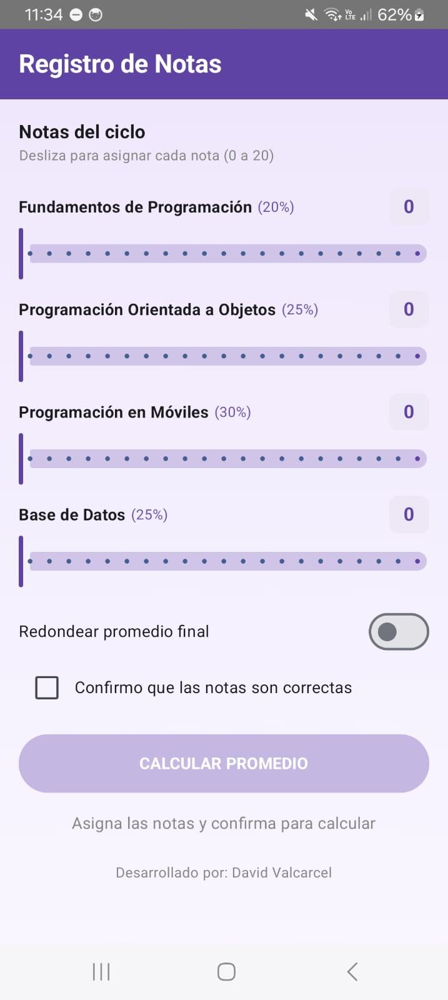
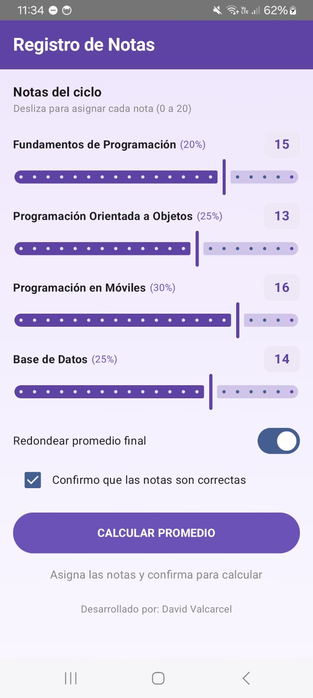
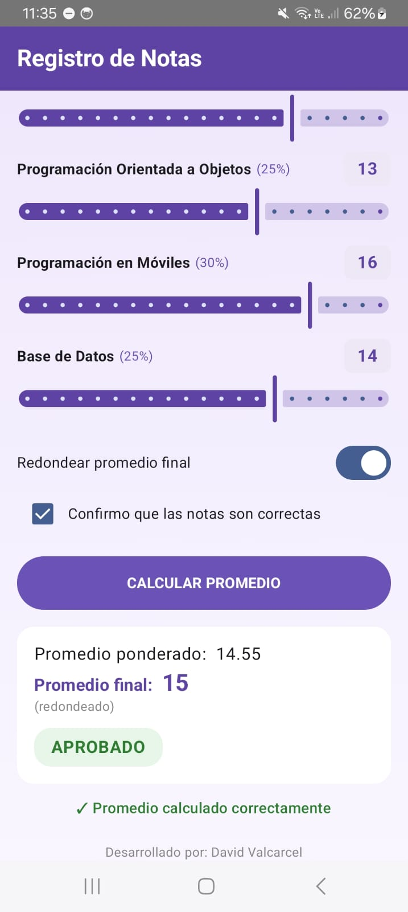
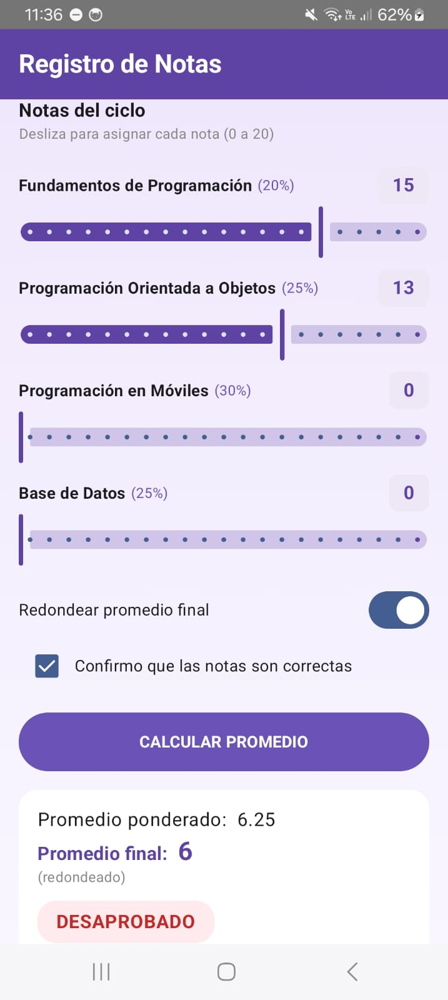
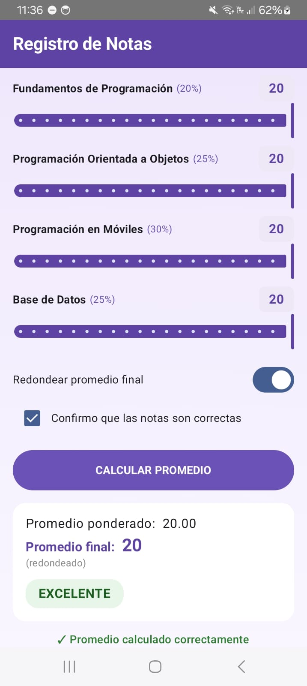
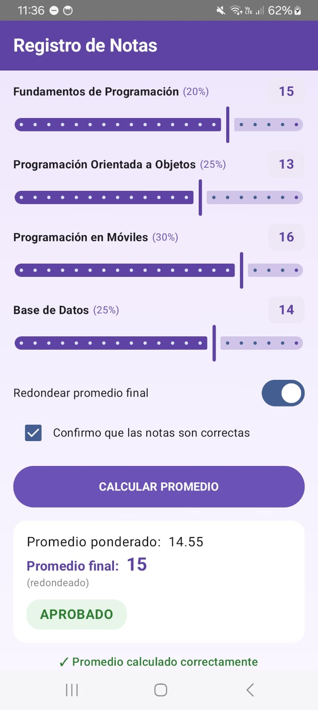
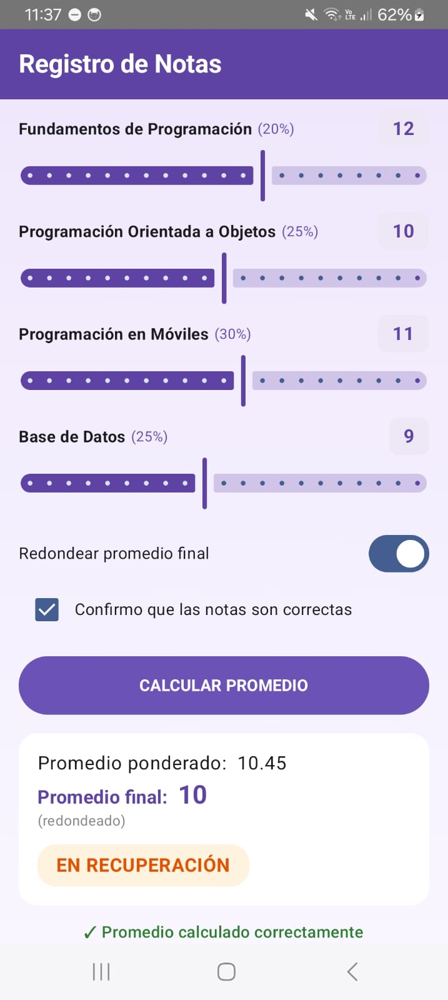
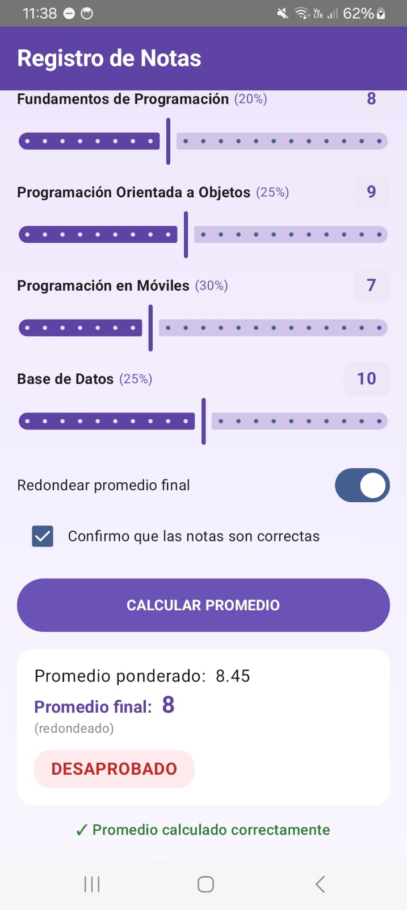
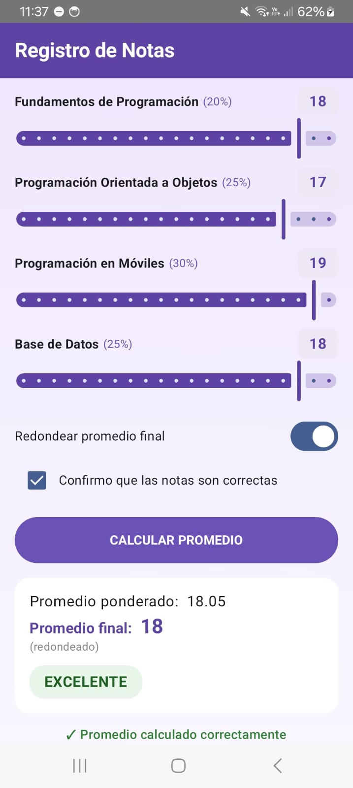

## Descripción del Proyecto

Aplicación desarrollada en **Android Studio** utilizando **Jetpack Compose** para calcular el promedio ponderado de cuatro cursos del ciclo. El proyecto demuestra el uso práctico de controles de entrada interactivos (`Slider`, `Switch`, `Checkbox`) y el manejo de estados mutables dentro de la arquitectura declarativa de Compose.

### Características Clave
* **Control de Notas con Sliders:** Selección de valores enteros (rango 0 a 20) con badges visuales actualizados en tiempo real.
* **Cálculo Ponderado Dinámico:** Aplicación de pesos específicos por curso:
    * Fundamentos de Programación (20%)
    * Programación Orientada a Objetos (25%)
    * Programación en Móviles (30%)
    * Base de Datos (25%)
* **Opciones de Redondeo:** Conmutador (`Switch`) para alternar entre promedio decimal y redondeado al entero más cercano (`roundToInt`).
* **Validación y Confirmación:** Botón principal protegido con propiedad `enabled`, condicionado a la activación del `Checkbox` de confirmación.
* **Feedback Visual:** Despliegue de la tarjeta de resultados acompañada de una observación semántica (Chip de color según la escala: Excelente, Aprobado, En Recuperación, Desaprobado).

---
## Capturas de Pantalla

### 1. Estado Inicial
*Formulario con notas en 0, switch desactivado y botón de cálculo deshabilitado hasta confirmar.*

### 2. Promedio Calculado
*Visualización del promedio ponderado, promedio final con redondeo y chip de estado.*

