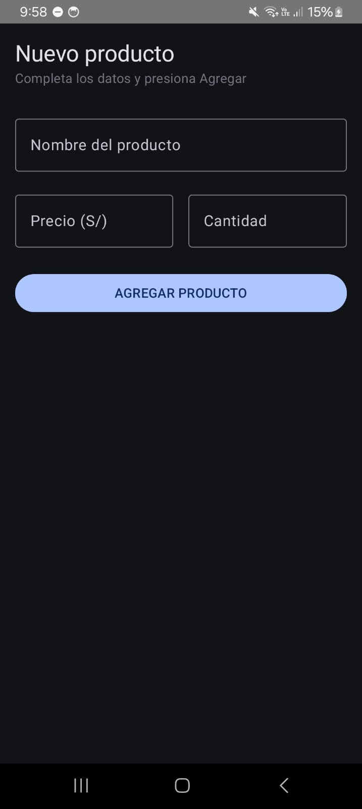
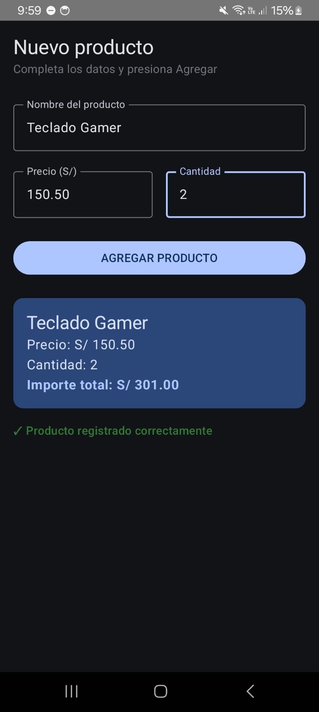

# Laboratorio 03: Registro de Producto

**Curso:** Programación Móvil

## Descripción
Aplicación en Android Studio desarrollada con Jetpack Compose para el registro de productos. Implementa estados (`remember` y `mutableStateOf`), componentes de Material Design 3 (OutlinedTextField, Button, Card) y formateo de moneda.

## Capturas de Pantalla

### 1. Pantalla Inicial (Vacía)

### 2. Producto Registrado

---

## Pregunta de Reflexión
**¿Qué pasaría si declaras las variables de los campos SIN `remember`?**

**Respuesta:**
Si declaramos las variables de estado únicamente con `mutableStateOf("")` sin envolverlas en `remember`, el estado perdería su valor en cada recomposición del composable, ya que cada vez que el usuario ingresa un carácter en un campo de texto, Jetpack Compose dispara una recomposición que reinicializaría la variable nuevamente a una cadena vacía `""`, provocando que el texto ingresado desaparezca al instante y la interfaz sea incapaz de conservar o procesar los datos introducidos.